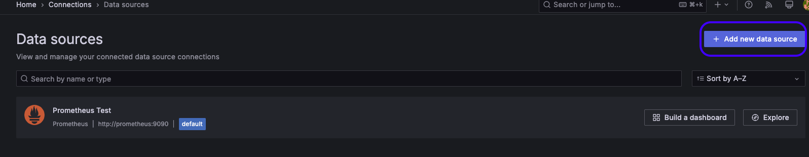

# Rust Actix with Prometheus + Grafana Monitoring
Taken from Coursera "Rust for DevOps" class

<div style="display: flex; justify-content: center;">
  
</div>

## Installation and starting `actix-web` server
1. Pull this project onto a VM or Local Machine.

    📝 **NOTE:** to use this as is, you must be run this from a Desktop enviroment. For production use, edit the `static_configs: targets` value in the `prometheus.yaml` file

    ```bash
    git pull https://github.com/Trozzel/coursera-prometheus-starter.git
    ```
2. Move into the `coursera-prometheus-starter` directory:
    ```bash
    cd coursera-prometheus-starter
    ```
3. Run either `make run` or `cargo run` from the 
    ```bash
    cargo run
    ```
    \- OR -
    ```bash
    make run
    ```
4. In another terminal from within the `coursera-prometheus-starter` folder, start the Prometheus and Grafana containers:
    ```bash
    docker-compose -f docker-compose.yaml up
    ```
    This will pull the Prometheus and Grafana containers and run them.


## Setup Grafana

### Connect a Data source

1. In your browser, go to `http://localhost:3000`. This will bring you to the Grafana setup page.
2. Enter default credentials (*see docker-compose.yaml file, under: `GF_SECURITY_ADMIN_USER` and `GF_SECURITY_ADMIN_PASSWORD`*)
  - user: "admin"
  - password: "admin"

    Update the password, if you desire.

3. Add a "Data source"
  

4. On the "Data sources" page, click the "Add new data source" button:
  

5. On the "Add data source" page, select "Pometheus"
  

6. Name the data source appropriately (example: "Prometheus with Actix")

7. Add connection to the *Docker exposed port* (*see `docker-compose.yaml` file, under: `ports`*) in the "Pometheus server URL" field:
  
  
8. Scroll to bottom and click "Save & test" button

### Create a new Dashboard
1. After creating the data source, click on the "Dashboards" item in the left navbar and then click "New" > "New dashboard"
  

2. Click "+ Add Visualization" and select your data source

3. Add metrics
    1. Go to lower right and select the "code" button.
    2. Enter the query:
      `sum(rate(redactr_http_request_total{status="404"}[5m]))`[^1]
    3. *Optional* click the "+ Add query" to add another query:
      `sum(rate(redactr_http_request_total{status="200"}[5m]))`[^1]

---
[^1]: `redactr_` preface taken from the `PrometheusMetricsBuilder::new("redactr")...` in `src/main.rs`

